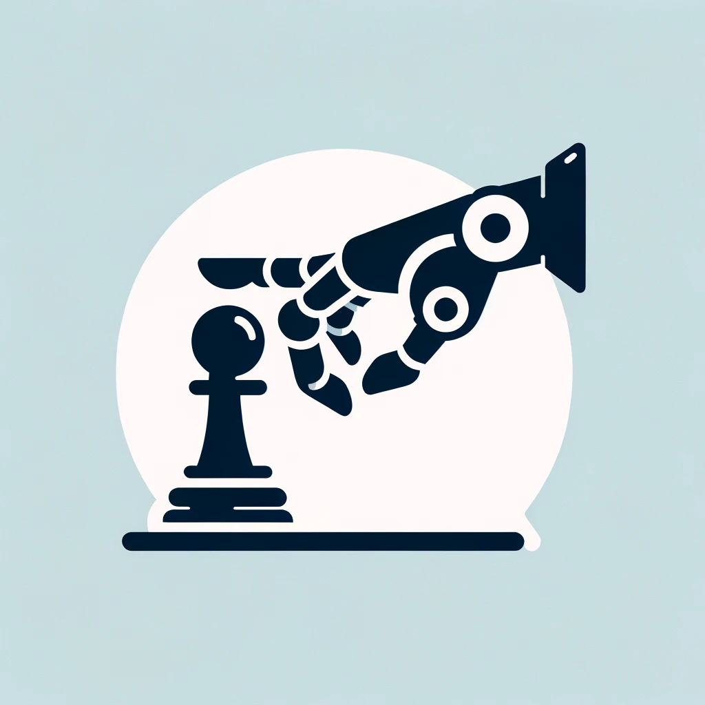
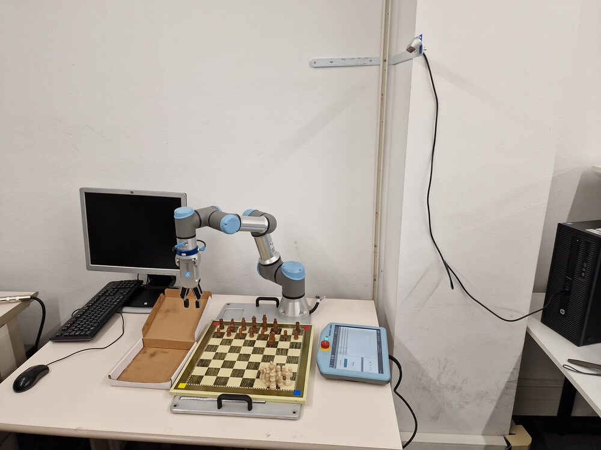

<h1>
    
ChessMate: Robotic Chess Companion 
</h1>

ChessMate is an advanced robotic chess companion that brings the classic game of chess into the modern era with interactive play against a computer or a physical robotic arm. Whether you're practicing against sophisticated AI or just playing for fun against friends, ChessMate offers an engaging chess experience with multiple modes and adaptive control systems.

## Features

- **Multiple Game Modes**: Choose from Human vs. Human, Human vs. Engine, or Engine vs. Engine.
- **Robotic Arm Integration**: Experience the physical movement of chess pieces with an automated robotic arm.
- **Advanced Engine Options**: Play against renowned chess engines like Stockfish and Leela Zero.
- **Audio & Visual Interaction**: Engage with the game using intuitive audio commands or through a real world chessboard.
- **Customizable Engine Parameters**: Adjust the difficulty and behavior of the chess engines.

## Getting Started

Follow these instructions to set up ChessMate on your local machine for development and testing purposes.

### Prerequisites

- Python 3.10.5 or later
- pip (Python package manager)
- Access to a command terminal

### Installation

1. **Python Installation:**
   - Download and install Python 3.10.5 from the [Python releases for Windows](https://www.python.org/downloads/windows/).
   - During installation, ensure to check the "Add Python to PATH" option.

2. **Project Setup:**
   - Clone or download the ChessMate repository to your local machine.
   - Navigate to the ChessMate directory in your terminal.
   - Install the required dependencies using pip:
     ```bash
     pip install -r requirements.txt
     ```

### Running ChessMate

To start the ChessMate application:

1. Navigate to the `src` directory of the ChessMate project.
2. Run the main script using Python:
   ```bash
   python main.py
   ```

### Configuration

ChessMate's initial settings like camera and microphone activation, robotic arm host IP, and port settings are configured in the main.py script. Advanced engine parameters can be adjusted through the GUI under the "Advanced Engine Params" section before game initialization.

### Usage

Upon running ChessMate, select the desired game mode. If "Engine Settings" is toggled, you'll be prompted to configure engine settings. After configuration, the game interface will launch, allowing you to interact via the GUI or voice commands, depending on the mode and settings chosen.

### System Setup



To ensure a smooth ChessMate experience, the following hardware setup is recommended:

- Universal Robots UR3e: A precise and flexible robotic arm for moving chess pieces.
- Chessboard: A standard board with 4x4 cm squares.
- Chess Pieces: Regular chess pieces for interactive play.
- Dummy Box: An allocated space for capturing chess pieces.
- Bracket: A 30x50 cm bracket, typically used for microwaves, repurposed to support the camera.
- RealSense D435 Camera: Provides a top-down view of the chessboard for state recognition and move validation.
- USB A 3.0 to USB C Cable: Facilitates high-speed data transfer for real-time video processing.
- Computer: A computer with USB A ports and USB 3.0 support for optimal camera performance.

Ensure the robotic arm, chessboard, and camera are appropriately aligned and positioned for optimal performance and interaction.

### Acknowledgments

- Thanks to the Stockfish and Leela Chess Zero teams for their incredible chess engines.
- Gratitude to all contributors and testers who have helped shape ChessMate.
